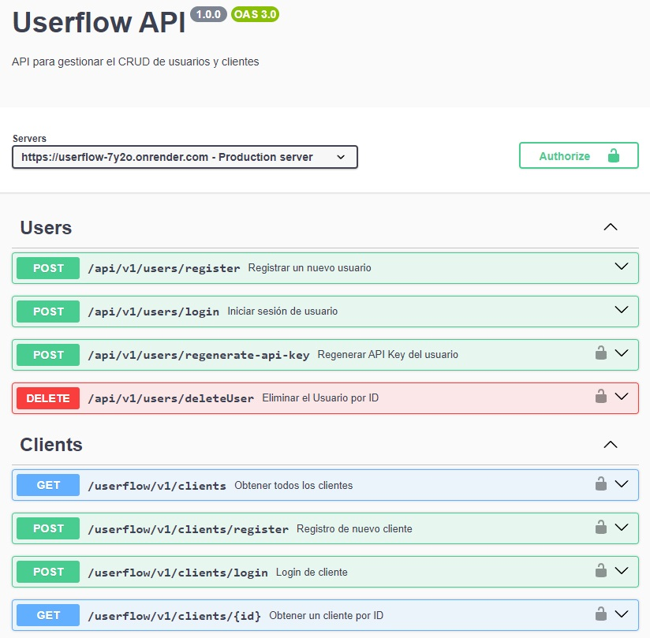

# UserFlow

UserFlow es una API diseñada para gestionar un CRUD de clientes, incorporando un sistema de autenticación basado en API keys. Los usuarios registrados pueden generar y utilizar una API key única para interactuar de manera segura con el backend.

## Despliegue 🚀

El proyecto UserFlow ha sido desplegado en [Render](https://render.com). Puedes acceder a la aplicación en el siguiente enlace:

- **URL de la aplicación**: [https://userflow-7y2o.onrender.com](https://userflow-7y2o.onrender.com)

### Documentación de la API 📚

La documentación de la API generada con Swagger está disponible en el siguiente enlace:

- **Swagger Docs**: [https://userflow-7y2o.onrender.com/api-docs](https://userflow-7y2o.onrender.com/api-docs)



## Tecnologías Usadas 🛠️

- **Node.js**: Entorno de ejecución para JavaScript en el servidor.
- **Express**: Framework web minimalista para Node.js.
- **MySQL**: Sistema de gestión de bases de datos relacional.
- **Prisma**: ORM para consultas de bases de datos en Node.js.
- **Morgan**: Middleware para registrar solicitudes HTTP.
- **JSON Web Token (JWT)**: Estándar para crear tokens de acceso.
- **Bcrypt**: Biblioteca para hashing de contraseñas.
- **dotenv**: Módulo para gestionar variables de entorno.
- **uuid**: Librería para generar identificadores únicos universales.
- **Zod** : Biblioteca para la validación. Garantiza que los datos de entrada cumplan con un formato específico antes de procesarlos.
- **CORS**: Middleware para habilitar Cross-Origin Resource Sharing en la aplicación.
- **ES6**: Versión de JavaScript con nuevas características.
- **Swagger**: Herramienta para generar documentación y pruebas de APIs RESTful.

## Herramientas 🔧

- Visual Studio Code (VSCode)
- Insomnia
- Git & GitHub
- MySQL Workbench

## Estructura del Proyecto 📂

#### Explicación
- 📁: Directorios.
- 📄: Archivos.
- 📝: Documentacion.
- 📜: Archivos de esquema o modelos.
- 🔒: Archivos relacionados con seguridad o autenticación.
- ⚙️: Archivos de configuración o de ajustes técnicos.

```
📁UserFlow/
├── 📁prisma/
│   ├── 📁migrations/
│   └── 📜 schema.prisma
├── 📁src/
│   ├── 📁controllers/📁v1
│   │   ├── 📄 clientController.js
│   │   └── 📄 userController.js
│   ├── 📁database/
│   │   ├── ⚙️ corsOptions.js
│   │   └── ⚙️ prismaClient.js
│   ├── 📁middlewares/
│   │   ├── 🔒 authApiKeyMiddleware.js
│   │   └── 🔒 authTokenMiddleware.js
│   ├── 📁models/📁v1
│   │   ├── 📜 clientModel.prisma.js
│   │   └── 📜 userModel.prisma.js
│   ├── 📁routes/📁v1
│   │   ├── 📄 client.Routes.js
│   │   ├── 📄 home.Routes.js
│   │   └── 📄 user.Routes.js
│   ├── 📁schemas/📁v1
│   │   ├── 📄 clientSchema.js
│   │   └── 📄 userSchema.js
│   ├── 📁services/📁v1
│   │   ├── 📄 clientService.js
│   │   └── 📄 userService.js
│   ├── 📁utils/
│   │   ├── 📄 generateApiKey.js
│   │   ├── 📄 generateJWT.js
│   │   └── 📄 hashPassword.js
│   └── 📄 index.js
├── 📁swagger/v1 📝
│   ├── 📁components/
│   │   ├── 📁schemas/
│   │   │   ├── 📄 UserRegistration.js
│   │   │   ├── 📄 UserLogin.js
│   │   │   ├── 📄 Client.js
│   │   │   ├── 📄 ClientInput.js
│   │   │   └── 📄 ClientUpdateInput.js
│   │   └── 📁securitySchemes/
│   │       ├── 🔒 apiKeyAuth.js
│   │       └── 🔒 bearerAuth.js
│   ├── 📁paths/
│   │   ├── 📁clients/
│   │   │   ├── 📄 getAllClients.js
│   │   │   ├── 📄 createClient.js
│   │   │   └── 📄 clientById.js
│   │   └── 📁users/
│   │       ├── 📄 deleteUser.js
│   │       ├── 📄 register.js
│   │       ├── 📄 login.js
│   │       └── 📄 regenerateApiKey.js
│   ├── 📄 info.js
│   ├── 📄 servers.js
│   ├── 📄 main.js
│   └── 📄 swaggerSpec.js
├── 📝 .env.example
├── 📄 .gitignore
├── 📄 package.json
└── 📝 README.md
```

## Contribución 💬

¡Contribuciones son bienvenidas! Si deseas contribuir a este proyecto, sigue estos pasos:

1. Haz un fork del proyecto.
2. Crea una nueva rama (`git checkout -b feature/nueva-feature`).
3. Realiza tus cambios y haz commit (`git commit -m 'Agrega nueva feature'`).
4. Haz push a la rama (`git push origin feature/nueva-feature`).
5. Abre un Pull Request.

## Licencia 📜

Este proyecto está licenciado bajo la Licencia. Consulta el archivo [LICENSE](LICENSE) para más detalles.

## Última Actualización 📑

- **Dia/Mes/Año** : 31-07-2024

### Historial de Actualizaciones 📅

- **31-07-2024**: Update/Fix Swagger and README.md
- **29-07-2024**: Implementación de Zod.
- **28-07-2024**: Actualización de los controladores para que usen los servicios.
- **26-07-2024**: Implementación de CORS para habilitar Cross-Origin Resource Sharing.
- **26-07-2024**: Despliegue del proyecto en Render.
- **25-07-2024**: Refactorización de código.
- **23-07-2024**: Implementación de la ruta / para verificar el estado del servidor con enlaces a la documentación de Swagger.
- **20-07-2024**: Implementación de Swagger.
- **16-07-2024**: Definición de los endpoints y adición de las rutas iniciales.
- **15-07-2024**: Adición de la estructura básica del proyecto y configuraciones iniciales.
- **15-07-2024**: Inicio del proyecto UserFlow.
